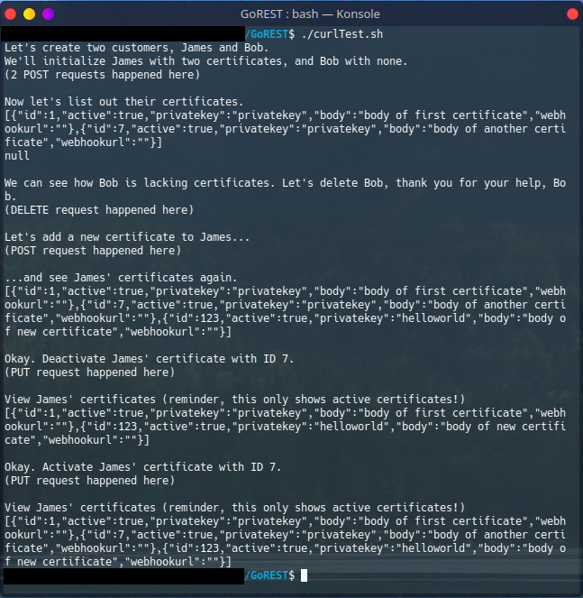

# GoREST
HTTP-based RESTful API written in Golang. Utilizes Postgres and Docker.

## Technologies used
* Golang
    * Chi
    * pgx (Postgres driver library)
* Postgres
* Docker

## Run it!
### Setup and run
```
sudo docker-compose up --build
```

### Testing
```
./curlTest.sh
```
Before rerunning, make sure to delete the postgres-data/ folder (`sudo rm -r -f postgres-data/`)and rerun the docker-compose build command. The testing bash script assumes this is a fresh never-before-used table where the two customer IDs will be 1 and 2.



### Stop and remove containers, network, images, etc.
```
sudo docker-compose down
```

## API details
### JSON structure examples
#### Customer
```
{
    "name": "James",
    "password": "mypassword",
    "certificates": []
}

```
#### Certificate
```
{
    "id": 3,
    "Active": true,
    "privatekey": "helloworld",
    "body": "body-of-the-certificate"
}
```
<sup>Note: Certificate ID uniqueness is not checked by the server. When toggling/deleting a certificate, the operation is only performed on the first certificate found with the provided ID.</sup>
#### Active status
```
}
    "active": false
}
```
#### Webhook JSON (received at optionally provided webhook URL)
```
{
    "active": false,
    "id": 2
}
```
<sup>Note: A URL may be specified when creating a certificate. This URL will be used whenever the server receives a PUT request to toggle the active status of this certificate. I personally used http://requestb.in/ to confirm functionality of this feature.</sup>

### Full API structure

```base_url/customers/{customer_id}/certificates/{certificate_id}```

### Features

```/customers```

* Create a customer
* Delete a customer

```/customers/{customer_id}```
* Delete a customer

```/customers/{customer_id}/certificates```
* Get all active certificates for a customer
* Create new certificate

```/customers/{customer_id}/certificates/{certificate_id}```
* Update active status for a certificate

## Project structure
* main.go - contains main function
* handlers - handlers for http requests
* db.go - functions relating to database access